#  macUSB

### Creating bootable macOS and OS X USB drives has never been easier!

    [](https://kruszoneq.github.io/macUSB/)

**macUSB** is a guided macOS app focused on creating bootable USB installers on Apple Silicon and Intel Macs, using local `.dmg`, `.iso`, `.cdr`, `.app` sources or the built-in downloader.

## 📥 How to Download macUSB

Choose one installation method:

1. **GitHub Releases:** [Download latest release](https://github.com/Kruszoneq/macUSB/releases/latest)
2. **Homebrew:**

```bash
brew install --cask macusb
```

**Project website:** [macUSB](https://kruszoneq.github.io/macUSB/)

---

## ☕ Support the Project

**macUSB is and will always remain completely free.** Every update and feature is available to everyone.  
If the project helps you, you can support ongoing development:

<a href="https://www.buymeacoffee.com/kruszoneq" target="_blank"></a>

---

<p align="center">
  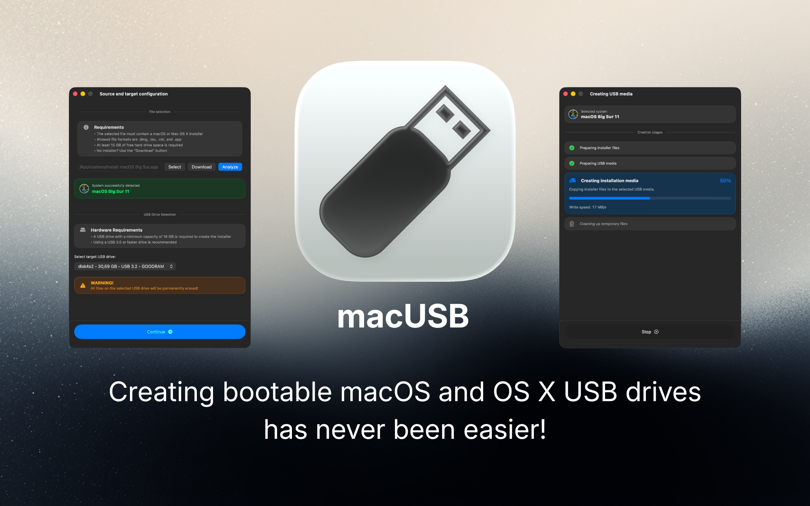
</p>

---

## 🔍 Why macUSB Exists

As Apple Silicon Macs became the default host machines, preparing bootable USB installers for **macOS Catalina and older** turned into a frequent support issue.

Common issues reported across forums and guides include:
- codesign and certificate validation failures on legacy installer paths,
- version-dependent compatibility constraints and tooling differences on newer hosts,
- manual terminal workflows that are easy to misconfigure and hard to verify.

**macUSB was built from practical research and tested fixes** gathered during repeated troubleshooting of these legacy installer scenarios.

---

## ✅ Key Features

- **Built-in Downloader:** discovers and downloads macOS installers available from Apple servers.
- **Local source support:** create USB from `.dmg`, `.iso`, `.cdr`, and `.app`.
- **One guided flow:** from source/downloader selection to final bootable media.
- **Apple Silicon legacy support:** automatic compatibility handling for older installers during bootable USB creation.
- **Automatic media prep:** partition and format checks with conversion when required.
- **PowerPC-ready paths:** dedicated support for Tiger/Leopard-era scenarios.

---

## ⚡ Quick Start

1. Install macUSB using one of the methods listed in **How to Download macUSB**.
2. Open macUSB and either:
   - choose a local installer file (`.dmg`, `.iso`, `.cdr`, or `.app`), or
   - use the built-in Downloader to fetch a macOS installer.
3. Select the target USB drive and review operation details.
4. Start creation and monitor stage-by-stage progress.
5. Use the final result screen for next steps.

> First launch note: macUSB requires two mandatory permissions for reliable installer creation: **enable Allow in the Background for macUSB** and **enable Full Disk Access for macUSB** in System Settings. Without these permissions, helper workflows may fail.

<table align="center">
  <tr>
    <td align="center" valign="top">
      <strong>Allow in the Background</strong><br>
      <a href="docs/readme-assets/permissions/allow-in-the-background.png">
        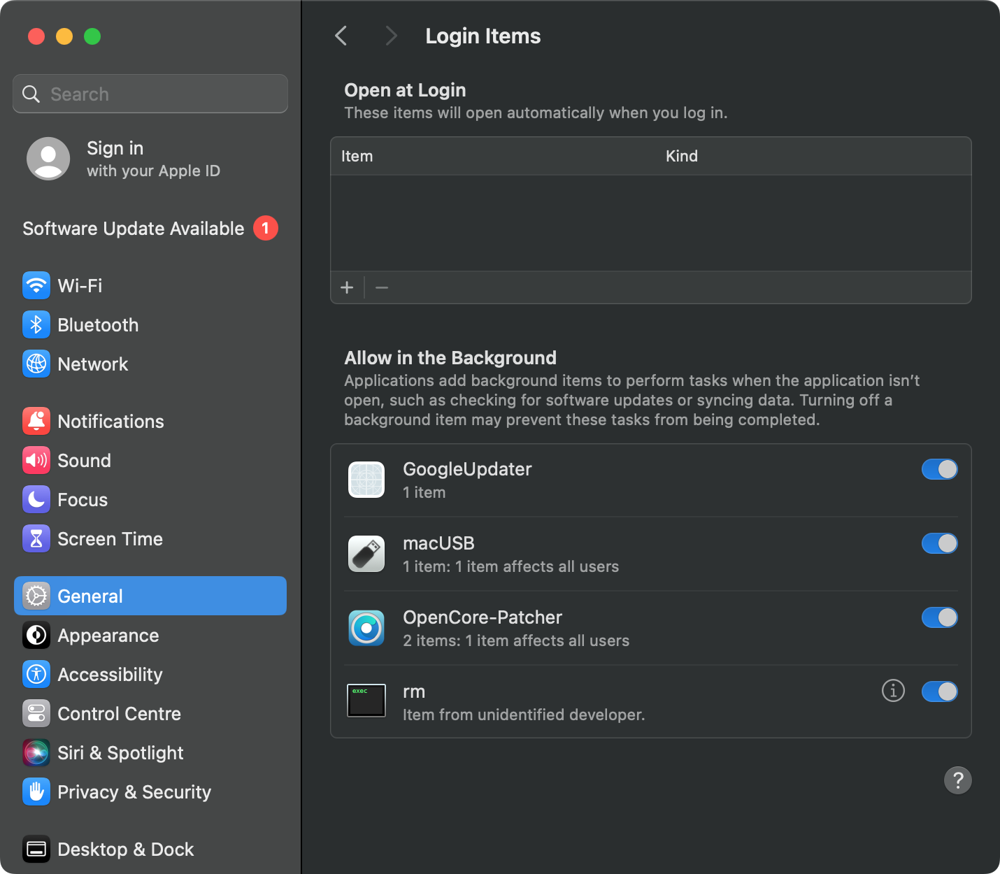
      </a><br>
      <sub>General → Login Items &amp; Extensions</sub>
    </td>
    <td align="center" valign="top">
      <strong>Full Disk Access</strong><br>
      <a href="docs/readme-assets/permissions/full-disk-access.png">
        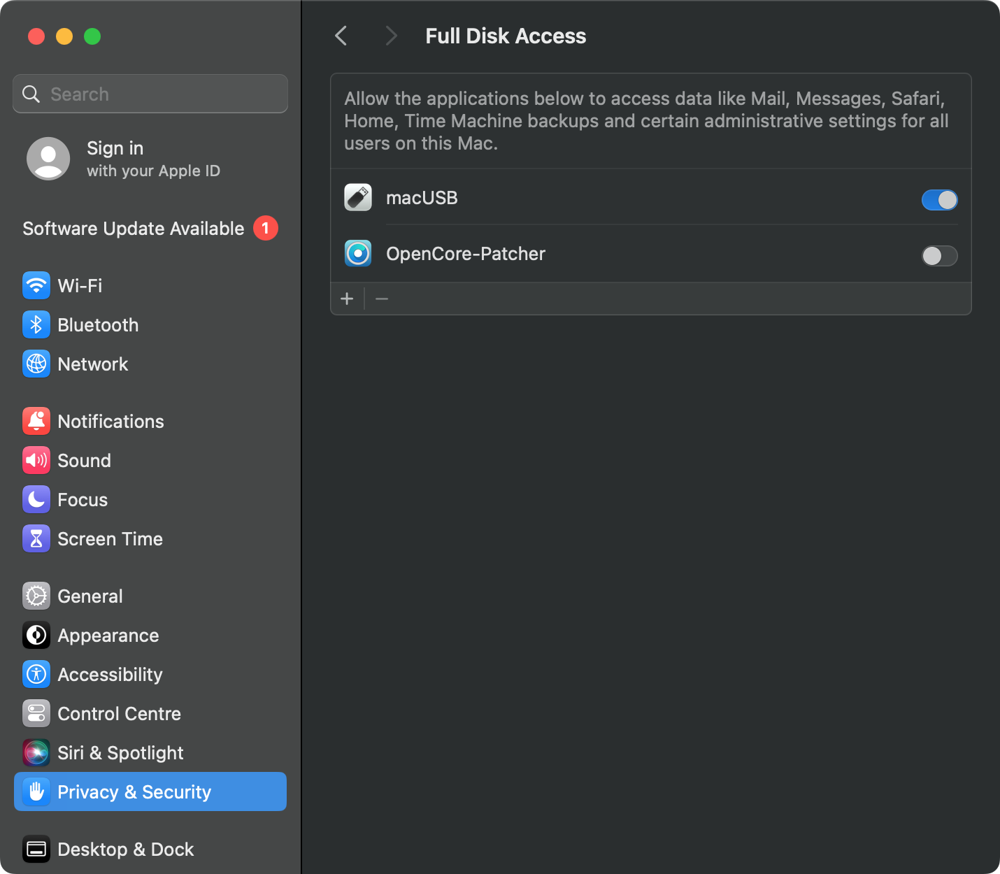
      </a><br>
      <sub>Privacy &amp; Security → Full Disk Access</sub>
    </td>
  </tr>
</table>

> Warning: All data on the selected USB drive will be erased.

---

## 🧭 App Workflow

<p align="center">
  Click any screenshot to open full size.
</p>

<table align="center">
  <tr>
    <td align="center" valign="top">
      <strong>1. Welcome</strong><br>
      <a href="docs/readme-assets/app-screens/welcome-view.png">
        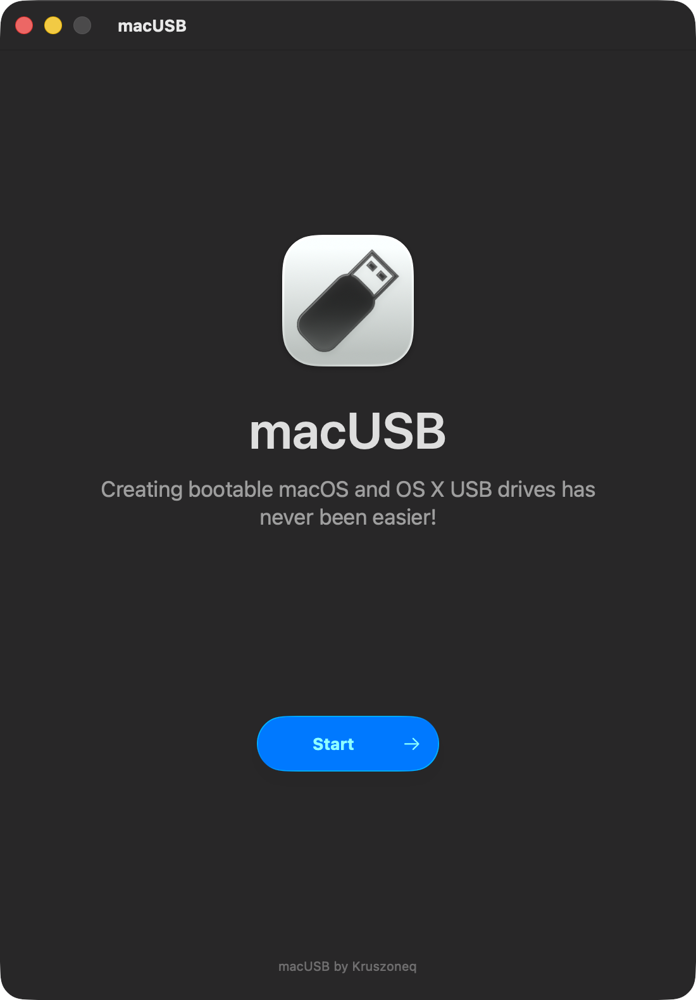
      </a><br>
      <sub>Start the workflow.</sub>
    </td>
    <td align="center" valign="top">
      <strong>2. Source &amp; Target</strong><br>
      <a href="docs/readme-assets/app-screens/source-target-configuration.png">
        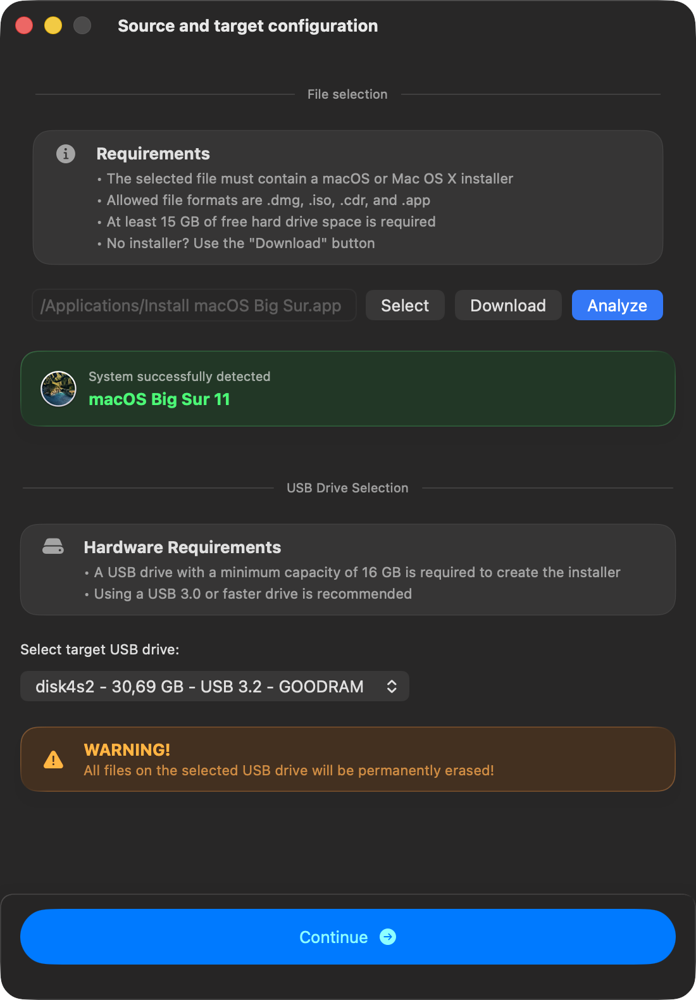
      </a><br>
      <sub>Choose local installer or Downloader, then select USB.</sub>
    </td>
    <td align="center" valign="top">
      <strong>3. Operation Details</strong><br>
      <a href="docs/readme-assets/app-screens/operation-details.png">
        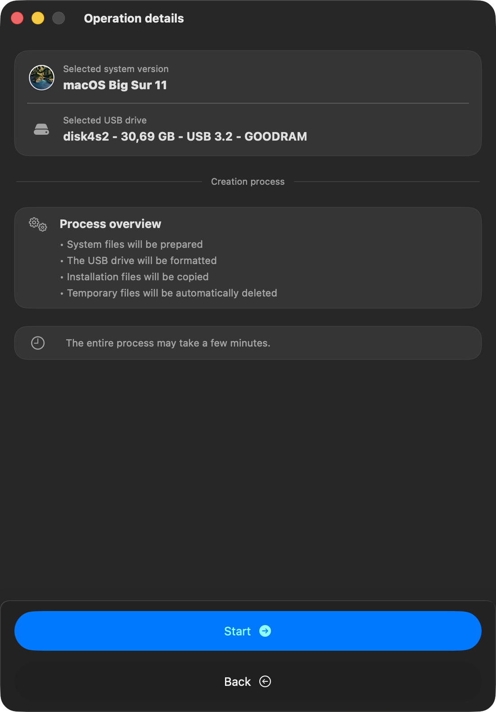
      </a><br>
      <sub>Review process before start.</sub>
    </td>
  </tr>
</table>

<table align="center">
  <tr>
    <td align="center" valign="top">
      <strong>4. Creating USB Media</strong><br>
      <a href="docs/readme-assets/app-screens/creating-usb-media.png">
        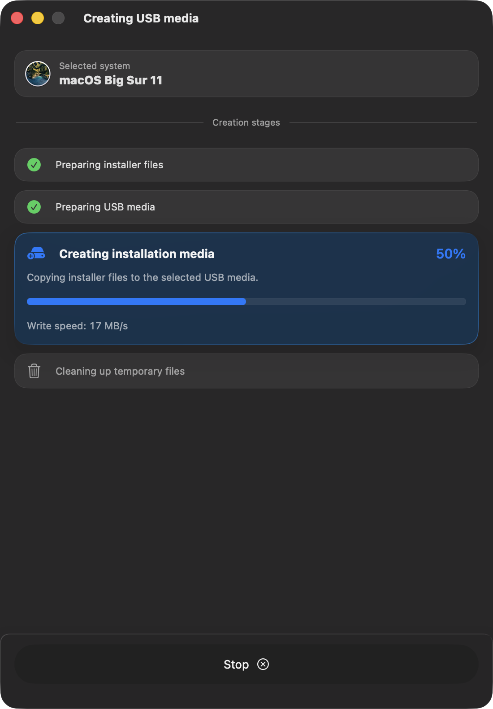
      </a><br>
      <sub>Track stage-by-stage progress.</sub>
    </td>
    <td align="center" valign="top">
      <strong>5. Operation Result</strong><br>
      <a href="docs/readme-assets/app-screens/operation-result.png">
        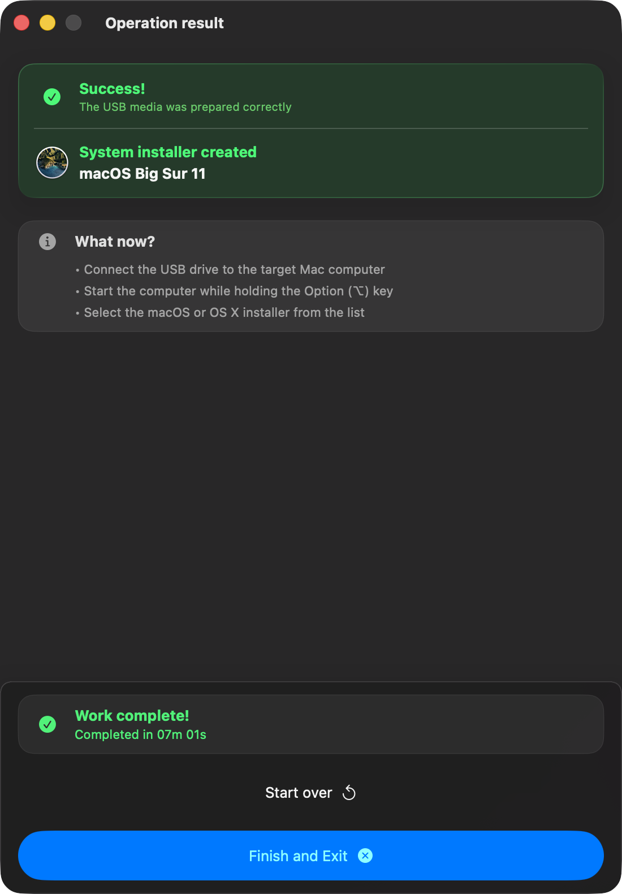
      </a><br>
      <sub>Finish with next-step guidance.</sub>
    </td>
  </tr>
</table>

---

## 🌐 Downloader Workflow

<p align="center">
  Click any screenshot to open full size.
</p>

<table align="center">
  <tr>
    <td align="center" valign="top">
      <strong>1. Installer List</strong><br>
      <a href="docs/readme-assets/app-screens/downloader-list.png">
        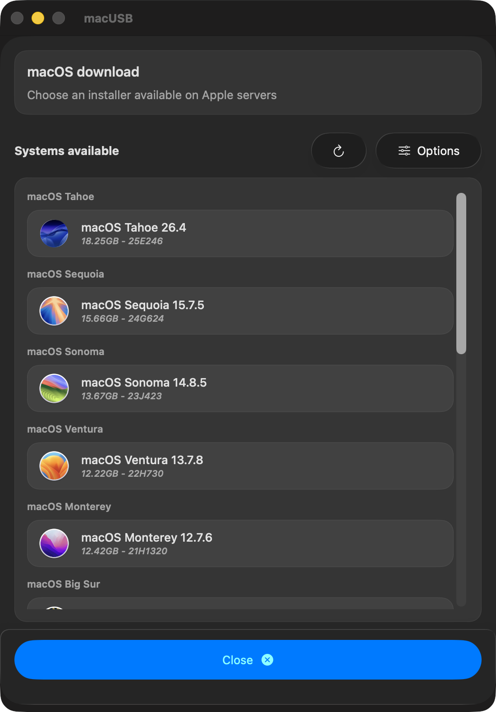
      </a><br>
      <sub>Browse macOS installers available from Apple servers.</sub>
    </td>
    <td align="center" valign="top">
      <strong>2. Download Progress</strong><br>
      <a href="docs/readme-assets/app-screens/downloader-process.png">
        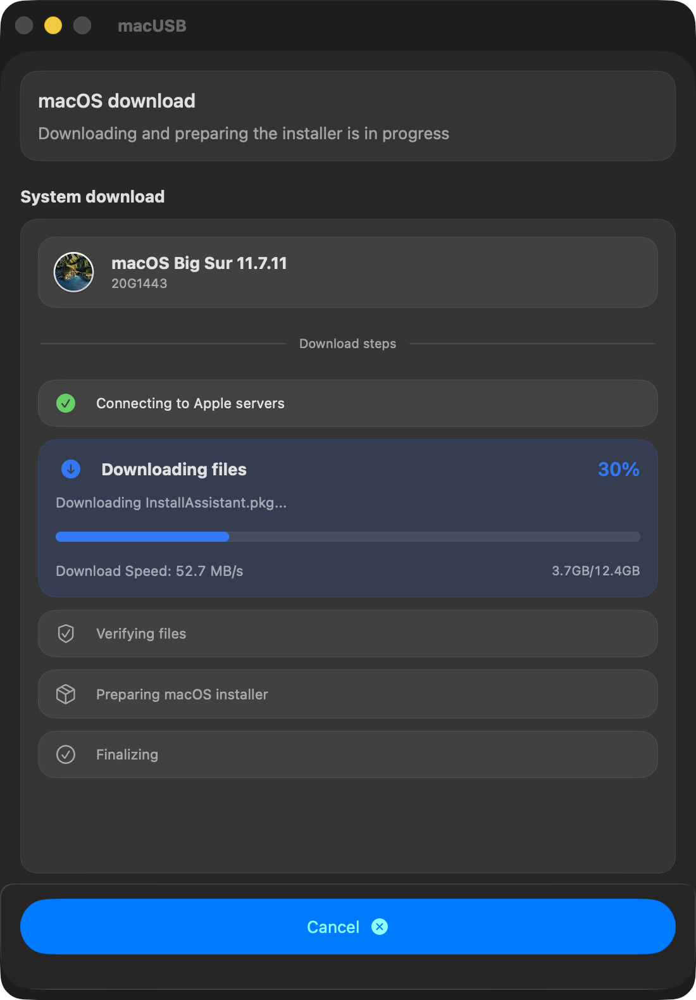
      </a><br>
      <sub>Track download and preparation progress in real time.</sub>
    </td>
    <td align="center" valign="top">
      <strong>3. Download Summary</strong><br>
      <a href="docs/readme-assets/app-screens/downloader-summary.png">
        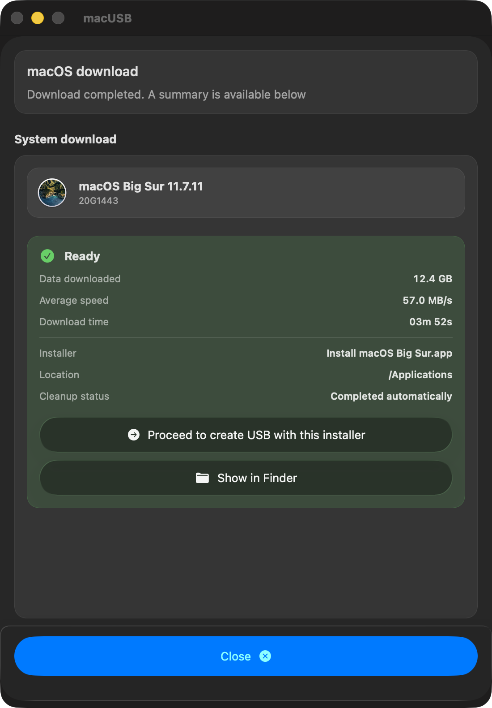
      </a><br>
      <sub>Review final status and use the installer in creation flow.</sub>
    </td>
  </tr>
</table>

---

## ⚙️ Requirements

### Host Computer
- **Processor:** Apple Silicon or Intel.
- **System:** **macOS 14.6 Sonoma** or newer.
- **Free disk space:**
  - **Downloader stage:** **15–45 GB**, depending on selected macOS version.
  - **Installer creation stage:** **10–20 GB**, depending on target system version.

### USB Media
- **Capacity:** at least **16 GB**; use **32 GB minimum** for **macOS 15 Sequoia** and **macOS 26 Tahoe** installers.
- **Performance:** USB 3.0+ is recommended.
- **External HDD/SSD support:** installer creation on external hard drives is disabled by default on every app launch to improve safety and reduce the risk of accidental target selection. You can enable it in **Options** → **Enable external drives support**.

### Installer Inputs
Accepted local installer types:
- `.dmg`
- `.cdr`
- `.iso`
- `.app`

Or use the built-in Downloader to fetch installers available from Apple servers.

---

## 💿 Supported Versions

Systems recognized and supported for USB creation:

| System | Version | Supported |
| :--- | :--- | :---: |
| **macOS Tahoe** | 26 | ✅ |
| **macOS Sequoia** | 15 | ✅ |
| **macOS Sonoma** | 14 | ✅ |
| **macOS Ventura** | 13 | ✅ |
| **macOS Monterey** | 12 | ✅ |
| **macOS Big Sur** | 11 | ✅ |
| **macOS Catalina** | 10.15 | ✅ |
| **macOS Mojave** | 10.14 | ✅ |
| **macOS High Sierra** | 10.13 | ✅ |
| **macOS Sierra**[^1] | 10.12 | ✅ |
| **OS X El Capitan** | 10.11 | ✅ |
| **OS X Yosemite** | 10.10 | ✅ |
| **OS X Mavericks**[^2] | 10.9 | ✅ |
| **OS X Mountain Lion** | 10.8 | ✅ |
| **OS X Lion** | 10.7 | ✅ |
| **Mac OS X Snow Leopard** | 10.6 | ✅ |
| **Mac OS X Leopard** | 10.5 | ✅ |
| **Mac OS X Tiger**[^3] | 10.4 | ✅ |

> The table describes versions supported for bootable USB creation.
> Downloader availability depends on installers currently published by Apple.

[^1]: Only **10.12.6** is supported.
[^2]: Fully verified with the image from [Mavericks Forever](https://mavericksforever.com/). Other sources may fail.
[^3]: **Single DVD** is auto-detected. **Multi-DVD** guide: [Tiger Multi-DVD Guide](https://kruszoneq.github.io/macUSB/pages/guides/multidvd_tiger.html).

---

## 🧩 Legacy & PowerPC Notes

A dedicated Open Firmware guide is available on the project website, based on real boot-testing of PowerPC USB workflows with installers created by macUSB.

Test coverage includes:
- **Mac OS X Tiger** and **Mac OS X Leopard** boot scenarios,
- **Single DVD** editions, and for Tiger also the **Multi-DVD** path,
- Open Firmware boot command usage verified on an **iMac G5** test machine.

If you are reviving a PowerPC Mac, use this [step-by-step guide](https://kruszoneq.github.io/macUSB/pages/guides/ppc_boot_instructions.html).

---

## 🌍 Available Languages

The interface follows system language automatically:

- 🇵🇱 Polish (PL)
- 🇺🇸 English (EN)
- 🇩🇪 German (DE)
- 🇯🇵 Japanese (JA)
- 🇫🇷 French (FR)
- 🇪🇸 Spanish (ES)
- 🇧🇷 Portuguese (PT-BR)
- 🇨🇳 Simplified Chinese (ZH-Hans)
- 🇷🇺 Russian (RU)
- 🇮🇹 Italian (IT)
- 🇺🇦 Ukrainian (UK)
- 🇻🇳 Vietnamese (VI)
- 🇹🇷 Turkish (TR)

---

## 🛠️ Diagnostics & Support

Use [GitHub Issues](https://github.com/Kruszoneq/macUSB/issues) for troubleshooting, bug reports, and feature requests.

Before submitting:
- use the appropriate issue template,
- attach diagnostic logs exported from `Help` → `Export diagnostic logs...`,
- attach screenshots showing the issue.

---

## ⚖️ License

Licensed under the **MIT License**.

Copyright © 2025-2026 Krystian Pierz
